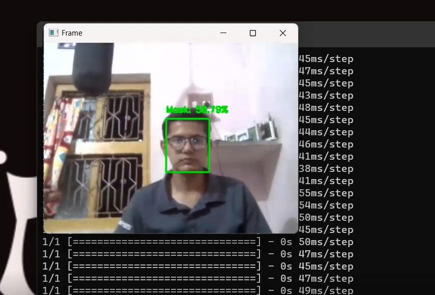

<h1 align="center"> Kashyap pathak Face Mask Detection</h1>

  <h4> Kashyap pathak Face Mask Detection System built with OpenCV, Keras/TensorFlow using Deep Learning and Computer Vision Concept we can use like neura network ,cnn,rnn and some we can work with real-time videos and image here we can say train the mask and using video and image we can  detect the mask.</h4>

##:smile:Made with Kashyap pathak(https://github.com/kashyappathak/ai/)
## Refrence with And Credit Given By :eyes:&nbsp;  by(https://github.com/chandrikadeb7)

